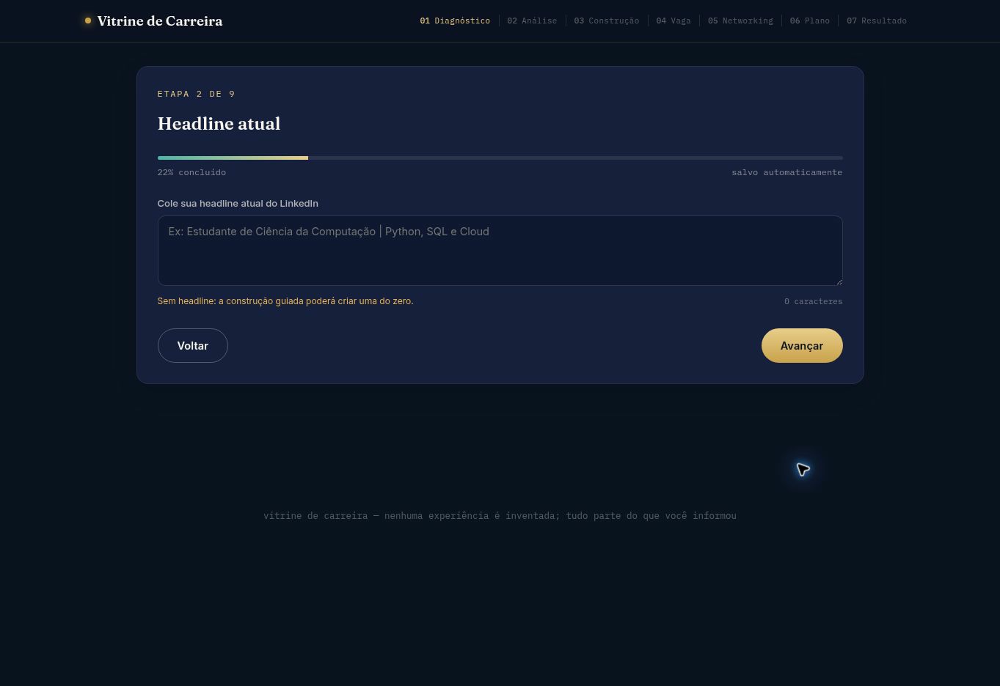

# Vitrine de Carreira

> Plataforma de diagnóstico e posicionamento profissional que transforma experiências reais em uma comunicação mais clara, estratégica e atraente para recrutadores.


## Sobre o projeto

A Vitrine de Carreira nasceu da ideia de transformar o processo de melhorar um perfil no LinkedIn em uma experiência guiada. A aplicação ajuda estudantes e profissionais a organizar a própria trajetória e convertê-la em um posicionamento mais claro — sem inventar experiências ou resultados.

O projeto é independente e não é uma ferramenta oficial do LinkedIn.

## Problema

Muitos estudantes e profissionais possuem experiências, projetos e competências relevantes, mas têm dificuldade em transformar essas informações em um perfil profissional claro e estratégico.

## Solução

A plataforma organiza uma jornada estruturada:

**informações profissionais → diagnóstico → recomendações → construção → comparação com vagas → networking → plano de evolução**

## Funcionalidades

- diagnóstico e pontuação estimada do perfil;
- análise de headline, Sobre, formação, experiências, projetos, certificações e competências;
- identificação de pontos fortes, lacunas e palavras-chave por área;
- sugestões de headline e construção guiada da seção Sobre;
- comparação do perfil com descrições de vagas;
- compatibilidade estimada e modelos de networking;
- plano priorizado de evolução e antes × depois projetado;
- posicionamento profissional final;
- salvamento local e retomada do progresso;
- layout responsivo para dispositivos móveis.

## Áreas profissionais

A versão atual suporta dezenas de áreas, entre elas Tecnologia, Desenvolvimento de Software, Inteligência Artificial, Dados & Analytics, Automação, Cloud, Cybersecurity, Produto, Consultoria, Marketing, Vendas, Finanças, Jurídico & Direito, Saúde, Psicologia, Educação, Recursos Humanos, Contabilidade, Engenharia, Logística, Supply Chain, Agronegócio, Sustentabilidade & ESG e Setor Público.

## Tecnologias

- HTML5
- CSS3
- JavaScript
- LocalStorage
- Responsive Design

## Como funciona

```text
Dados profissionais
        ↓
Diagnóstico
        ↓
Construção guiada
        ↓
Comparação com vaga
        ↓
Networking
        ↓
Plano de evolução
        ↓
Posicionamento final
```

## Demonstração



*Captura real da aplicação publicada, mostrando progresso, salvamento automático e construção guiada da headline.*

## Como testar

**Acesse a aplicação publicada:** [https://sandrozdb.github.io/vitrine-de-carreira/](https://sandrozdb.github.io/vitrine-de-carreira/)

## Executar localmente

```bash
git clone https://github.com/sandrozdb/vitrine-de-carreira.git
cd vitrine-de-carreira
```

Depois, abra `index.html` em um navegador moderno.

## Privacidade

Nesta simulação demonstrativa, as funções de cadastro, banco de dados e backend foram representadas pelo armazenamento local do navegador com `localStorage`. Durante os testes, os dados preenchidos permanecem no próprio dispositivo do usuário.

Consulte [PRIVACY.md](PRIVACY.md) para mais detalhes.

## Limitações atuais

- A análise utiliza heurísticas e regras executadas localmente.
- A pontuação não é oficial do LinkedIn.
- Os resultados são estimativas orientativas e não representam garantia de aprovação em processos seletivos.
- O produto está em fase de validação com usuários.

## Status

**MVP em validação — v1.1**

## Roadmap

### v1.x

- validação com usuários;
- ajustes de experiência e responsividade;
- melhoria das regras de análise;
- incorporação do feedback dos primeiros testes.

### v2.0

- backend próprio;
- integração segura com LLM;
- análises semânticas;
- recomendações mais contextuais.

### Futuro

- importação do PDF do LinkedIn;
- conta e histórico do usuário;
- banco de dados e dashboard;
- análise de múltiplas vagas;
- acompanhamento da evolução do perfil.

O roadmap completo está em [docs/ROADMAP.md](docs/ROADMAP.md).

## Autor

**Sandro Ferreira**

- [LinkedIn](https://www.linkedin.com/in/sandrozdb/)
- [GitHub](https://github.com/sandrozdb)

## Licença

Distribuído sob a licença MIT. Consulte [LICENSE](LICENSE).
